# Flexilis

**Flexilis**는 스트레칭 알림 데스크톱 애플리케이션입니다.
알람이 등록된 시간에 선택한 부위의 스트레칭 영상이 팝업으로 재생됩니다.
알림 영상 하단에는 광고를 게시할 수 있으며 이를 관리하기 위한 admin 페이지가 존재합니다.
admin 페이지에서는 결제를 통해 광고를 등록할 수 있으며 사용자가 등록한 광고의 대시보드를 확인할 수 있습니다.

## 목차
- [관련 링크](#관련-링크)
- [테크 스택](#테크-스택)
- [역할분담](#역할분담)
- [개발동기](#개발동기)
- [개발기간](#개발기간)
- [기능소개](#기능소개)
- [어려웠던 점](#어려웠던-점)

## 관련 링크

Front - https://github.com/Team-HHH/vaco9-team-frontend

Server - https://github.com/Team-HHH/vaco9-team-server

Electron - https://github.com/Team-HHH/vaco9-team-electron

배포 링크 - https://flexilis.xyz

발표 영상 - https://youtu.be/0G53ypQTac8?t=6932

## 테크 스택

**Frontend**

- ES2015+
- React
- React Router
- React Hook Form
- React Select
- Redux, Redux-thunk
- Recharts
- D3.js
- Joi

**Backend**

- Node.js
- Express
- Mongoose
- AWS Simple Cloud Storage (S3)
- Multer
- Joi
- Argon2

**Electron**

- Electron
- Electron Forge
- React
- Redux, Redux-thunk
- Joi
- Keytar

## 역할분담

- 김희찬 : 웹 메인페이지, 캠페인 등록 및 결제, 대시보드 및 차트, 캠페인별 마케팅 지표 계산, 백엔드, 일렉트론 팝업 및 알람 로직
- 유경호 : 웹 로그인, 배너 미리보기, 백엔드 리팩토링
- 정형주 : 웹 회원가입, 모달, 입력값 검증, 배너 업로드 및 S3 연결, CSS 스타일링, 지도 차트, 일렉트론 react 및 redux

## 개발동기
최근에 오랜 시간 책상에 앉아서 일하거나 온종일 서 있는 직장인들 사이에 허리디스크가 나이를 불문하고 나타나고 있는데, 이런 질환들을 예방하기 위해서 적어도 1시간은 한 번씩은 자리에서 일어나 가볍게 스트레칭을 해주는 것이 좋다는 기사를 보았습니다. 특히 개발자의 경우 항상 앉아서 일하고 움직임이 거의 없습니다. 그래서 일하는 중에도 꾸준하게 스트레칭을 할 수 있도록 도와주는 앱을 개발하게 되었습니다. 

## 개발기간

1주차 (21. 4. 12 ~ 21. 4. 18)

- 아이디어 기획
- UI Mock up 작성
- DB Schema 작성
- Task card 작성
- 초기 폴더 세팅

2주차 (21. 4. 19 ~ 21. 4. 25)

- 어드민 캠페인 등록 기능 구현
- 어드민 캠페인 등록시 결제기능 구현
- 어드민 대시보드 페이지 구현 및 지표별 그래프 추가
- 일렉트론 알람, 팝업 기능 구현

3주차 (21. 4. 26 ~ 21. 4. 30)

- 어드민 대시보드 지도 그래프 추가
- 어드민 대시보드에서 결제기능 추가
- 어드민 캠페인 등록시 예상 결과도출 기능 추가
- Keychain을 활용한 일렉트론 자동로그인 기능 추가
- 사이트 배포

## 기능 소개
|                                                              |                                                              |
| ------------------------------------------------------------ | ------------------------------------------------------------ |
| 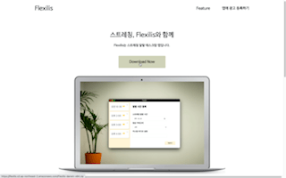 메인 페이지입니다. 일렉트론 어플리케이션을 다운로드 받을 수 있습니다. | 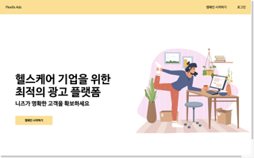 광고주를 위한 어드민 메인 페이지입니다. |
| 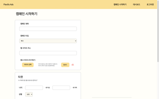 캠페인 등록을 위한 페이지입니다. | 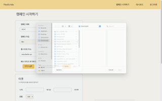 캠페인 등록시 유저에게 보여줄 배너 이미지를 S3에 업로드하는 기능입니다. |
| 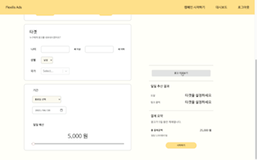 업로드한 배너가 유저에게 어떻게 노출될지 보여주는 광고 미리보기 기능입니다. | 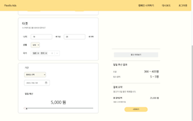 광고주가 설정한 나이, 성별, 국가, 기간, 일일 예산에 따라 광고가 몇명에게 노출되고 몇명이 클릭할지 보여주는 일일 추산 결과 기능입니다. |
| 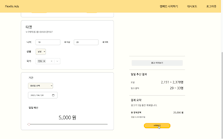 캠페인 시작하기를 누르면 결제창이 표시되고, 광고 기간과 일일 예산에 따라 산정된 금액이 결제됩니다. |                                                              |
| 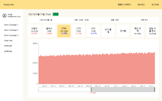 캠페인을 등록한 광고주는 대시보드 페이지에서 캠페인별로 성과를 확인할 수 있습니다. 다양한 마케팅 지표와 그래프가 제공됩니다. | 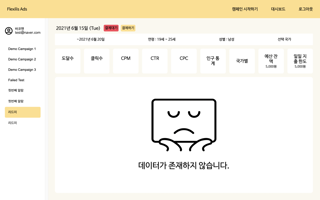 캠페인 등록 과정에서 결제에 실패한 경우 대시보드에서 다시 결제를 진행할 수 있습니다. |
| 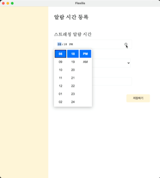 일렉트론 어플리케이션에서 알람을 등록하는 기능입니다. |  일렉트론 어플리케이션에서 알람 3분전에 알려주는 기능입니다. |
| 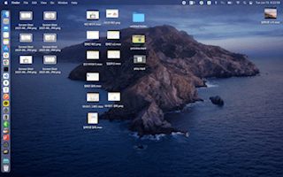 등록한 시간이 되면 전체화면으로 팝업이 되면서 선택한 카테고리의 스트레칭 영상이 재생되고 하단에 배너가 표시됩니다. 이때 배너는 사용자가 타겟인 캠페인의 배너가 표시됩니다. |                                                              |

## 어려웠던 점

#### 서버와 프론트의 날짜 계산 차이

- 서버는 자동으로 UTC 를 기준으로 시간을 계산하고, 프론트에서는 local timezone을 기준으로 시간을 계산했습니다. 처음에는 그 차이를 인지하지 못하다가 DB에 쿼리를 하면서 날짜가 일치하지 않는 이슈가 발생했습니다.
- 처음에는 프론트 timezone을 기준으로 서버에 저장하려고 시도했지만 만약 서비스를 해외로 확장하게 된다면 또다른 문제가 발생할 것으로 예상되었습니다. 따라서 UTC를 기준으로 서버에 저장하고, 프론트에서 local timezone으로 변환하여 사용하는 것으로 문제를 해결하였습니다.

#### 캠페인 배너를 AWS S3에 저장하면서 발생한 문제

- 캠페인을 생성할 때 이미지 리소스를 서버에서 받지 못하는 이슈가 있었습니다. 이러한 이슈를 해결하기 위해 이미지와 텍스트를 각각 다른 form을 이용하여 이슈를 해결했습니다.

- 초기에 하나의 form을 이용하여 이미지를 보낼때 발생한 에러를 정확히 발견하기 위해 postman이라는 앱을 이용하여 서버 요청 테스트를 한 결과, 전송시 설정하지 않은 헤더인 content-length 값이 존재하는 것을 확인하였습니다.
- 이 content-length를 전송시 계산해주는 form attribute 중 하나인 enctype를 multipart/form-data로 설정하여 텍스트와는 별도의 form을 사용해서 전송하는 방식으로 해결했습니다.
